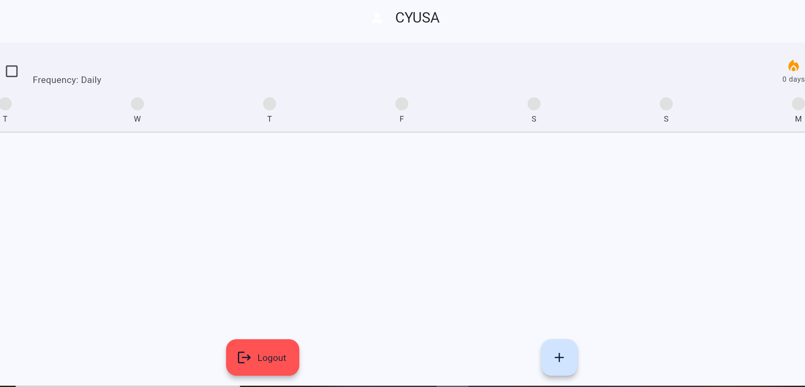
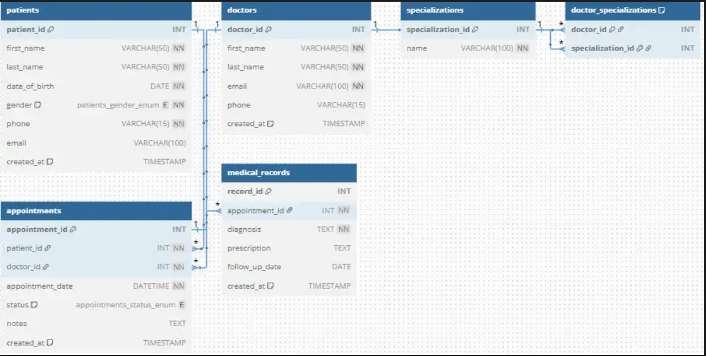

<!DOCTYPE html>
<html lang="en">
<head>
    <meta charset="UTF-8">
    <meta name="viewport" content="width=device-width, initial-scale=1.0">
    <title>Cyusa Alain | Portfolio</title>
    <link rel="stylesheet" href="style.css">
    <link href="https://fonts.googleapis.com/css2?family=Inter:wght@400;600&family=Poppins:wght@700&family=Sora:wght@600;700&display=swap" rel="stylesheet">
    <link rel="stylesheet" href="https://cdnjs.cloudflare.com/ajax/libs/font-awesome/6.0.0/css/all.min.css">
</head>
<body>

    <nav class="navbar">
        
Cyusa Alain

        <ul class="nav-menu">
            <li><a href="index.html" class="active">Home</a></li>
            <li><a href="blog.html">Blog</a></li>
            <li><a href="journey.html">Journey</a></li>
            <li><a href="support.html">Support</a></li>
        </ul>
    </nav>

    <main class="container">
        <section class="hero">
            <h1 class="hero-text">Hi, I'm Umuhire Cyusa Alain, a Full Stack Developer building scalable web applications.</h1>
        </section>

        <section class="bio-section">
            

                
            

            

                <h3>Biography</h3>
                
Analytical and solution-oriented developer adept at architecting high-performance, user-centric solutions. Proven ability to minimize system latency and bugs using modern frameworks and robust CI/CD pipelines.

            

            

                <h3>Lets connect</h3>
                

                    <a href="https://www.instagram.com/wizzy_alain?igsh=NzU3cDB5MGkyZTV3" target="_blank" rel="noopener noreferrer">
                        <i class="fab fa-instagram"></i>
                    </a>
                    <a href="https://x.com/cyusa_umuhire" target="_blank" rel="noopener noreferrer">
                        <i class="fab fa-twitter"></i>
                    </a>
                    <a href="#"><i class="fab fa-facebook"></i></a>
                    <a href="https://www.linkedin.com/in/cyusa-alain-9400772a5?utm_source=share_via&utm_content=profile&utm_medium=member_android" target="_blank" rel="noopener noreferrer">
                        <i class="fab fa-linkedin"></i>
                    </a>
                

            

        </section>

        <section class="what-i-do">
            

                

                    <h3>What I do</h3>
                    
Bridging the gap between front-end aesthetics and back-end logic.

                

                

                    

                        
<i class="fas fa-globe"></i>

                        <h4>Full stack development</h4>
                        
Architecting scalable applications using JavaScript, Python, and SQL.

                    

                    

                        
<i class="fas fa-clipboard-list"></i>

                        <h4>Mobile Solutions</h4>
                        
Crafting mobile-friendly PWAs and apps using Dart and Flutter.

                    

                    

                        
<i class="fas fa-server"></i>

                        <h4>System Optimization</h4>
                        
Reducing latency and managing Linux-based server configurations.

                    

                    

                        <i class="fas fa-arrow-right"></i>
                    

                

            

        </section>

        <section class="projects">
            <h2 class="section-title">Featured Project</h2>
            
            

                
                

                    Lifestyle Habit Tracker
                    <h3>UI/UX, Real-time data, Mobile-first.</h3>
                    
A full-stack Flutter application featuring Firebase Auth and real-time streak tracking. Users compete on habit-specific leaderboards with an integrated points and rewards system.

                

            

            

                
                

                    Clinic Booking System
                    <h3>Data Modeling, SQL, Relational Architecture.</h3>
                    
A normalized MySQL relational database designed for clinical management. Features complex many-to-many relationships, appointment scheduling constraints, and medical record integrity.

                

            

        </section>

        <section class="snippets">
            <h2 class="section-title">Code Snippet</h2>
            

                
                

                    <h4>Flutter/Dart Starter</h4>
                    
Mobile-friendly PWA boilerplate

                    

                        

                            <i class="fas fa-wind"></i>
                            <i class="fab fa-react"></i>
                        

                        <i class="fas fa-star yellow-star"></i> 8 Stars
                    

                

                

                    <h4>Python/SQL Backend</h4>
                    
Clean architecture for scalable data management.

                    

                        

                            <i class="fas fa-wind"></i>
                            <i class="fab fa-sass"></i>
                            <i class="fab fa-html5"></i>
                        

                        <i class="fas fa-star yellow-star"></i> 12 Stars
                    

                

                

                    <h4>CI/CD Pipeline</h4>
                    
A robust deployment script to minimize system bugs.

                    

                        

                            <i class="fas fa-wind"></i>
                            <i class="fab fa-react"></i>
                        

                        <i class="fas fa-star yellow-star"></i> 8 Stars
                    

                

                

                    <h4>JavaScript</h4>
                    
Powers interactive web experiences

                    

                        

                            <i class="fas fa-wind"></i>
                            <i class="fab fa-react"></i>
                        

                        <i class="fas fa-star yellow-star"></i> 8 Stars
                    

                

            

        </section>
    </main>

    
</body>
</html>